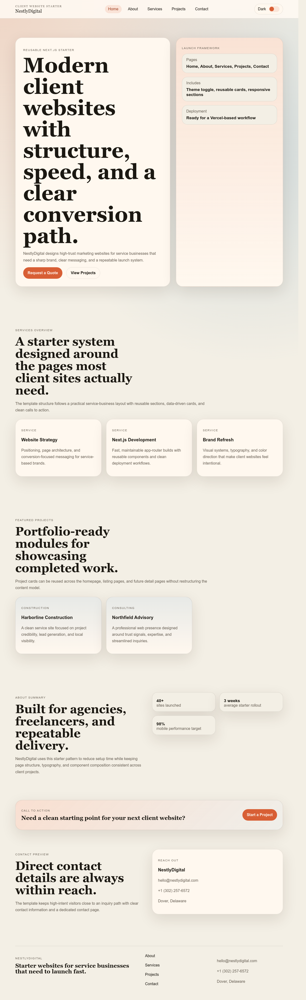
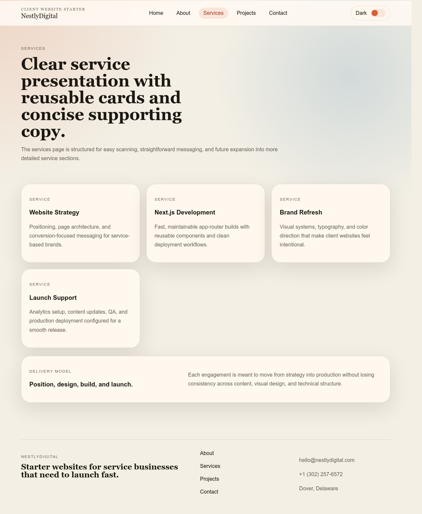
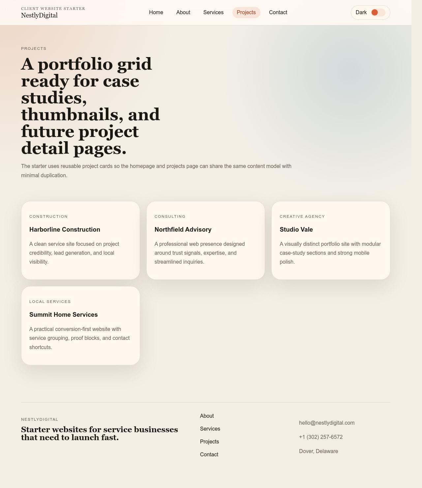
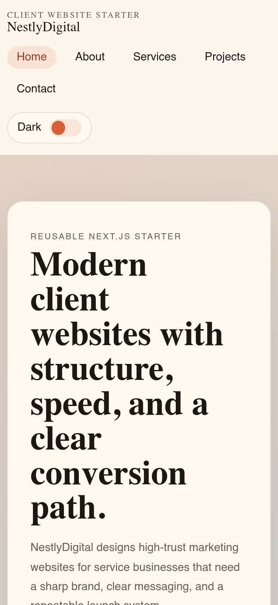

# 🚀 Next.js Client Website Starter


Build and launch professional client websites **2x faster** with this modern, production-ready Next.js starter template.

Designed by **NestlyDigital** to help agencies, freelancers, and businesses create high-quality websites with speed, consistency, and scalability.

---

## 🖥 Live Demo

[https://nextjs-client-website-starter.vercel.app/](https://nextjs-client-website-starter.vercel.app/)

Experience a fully functional modern business website built with Next.js and ready to customize for client projects.

---

## 🚀 Deploy Your Own Website

⚡ Launch your own professional website in under 2 minutes — no setup required.

[](https://vercel.com/new/clone?repository-url=https://github.com/nestlydigital/nextjs-client-website-starter&project-name=client-website&repository-name=client-website&demo-title=Next.js%20Client%20Website%20Starter&demo-description=Production-ready%20starter%20template%20for%20building%20modern%20client%20websites%20fast&demo-url=https://nextjs-client-website-starter.vercel.app/)

---

## 🖼 Website Preview

### 🏠 Homepage



---

### 🛠 Services Section



---

### 🏗 Projects / Portfolio



---

### 📱 Mobile Responsive View



---

## 🌐 What This Template Is

This is not just a template — it's a **complete system for building client websites efficiently**.

Whether you're creating a website for a construction company, agency, consultant, or local business, this starter gives you a **proven structure and reusable components** to get online fast.

---

## ⚡ Why Use This Starter

Most websites take too long to build from scratch.

This template helps you:

✔ Launch websites faster  
✔ Maintain a consistent professional structure  
✔ Reduce development time by up to 50%  
✔ Focus on customization instead of rebuilding basics  
✔ Deliver higher quality projects to clients  

---

## 🧱 What’s Included

This starter comes with all essential pages for modern business websites:

- 🏠 Homepage (Hero + sections ready)
- 🧑 About Us
- 👥 Our Team
- 🛠 Services
- 🏗 Projects / Portfolio
- 📩 Contact Page

---

## 🎨 Features

- Modern and clean design structure  
- Fully responsive (mobile-first)  
- Reusable components  
- Scalable architecture  
- SEO-friendly structure  
- Light / Dark mode toggle 🌙  
- Ready for deployment  

---

## 🛠 Tech Stack

- Next.js (latest version)  
- React  
- JavaScript / TypeScript  
- Modern CSS / Tailwind  

Optimized for deployment on **Vercel**.

---

## 🚀 Getting Started

Clone the repository:

```bash
git clone https://github.com/nestlydigital/nextjs-client-website-starter.git
````

Install dependencies:

```bash
npm install
```

Run development server:

```bash
npm run dev
```

Open:

```
http://localhost:3000
```

---

## 🔄 How to Use for Client Projects

1. Clone this template
2. Rename the project
3. Replace branding (logo, colors, content)
4. Update services, projects, and team data
5. Customize sections as needed
6. Deploy to Vercel
7. Connect client domain

You now have a **professional website ready for your client**.

---

## 💼 Built for Agencies & Freelancers

This template is ideal if you:

* Build websites for clients regularly
* Want a repeatable system
* Need faster delivery without sacrificing quality
* Want to standardize your development workflow

---

## 📈 Business Impact

Using a structured starter like this allows you to:

* Deliver projects faster
* Take on more clients
* Increase profitability
* Maintain consistent quality
* Build a scalable web development system

---

## 🧠 About NestlyDigital

**NestlyDigital** builds modern digital solutions for businesses.

We specialize in:

* Website Design & Development
* Next.js Web Applications
* Business Landing Pages
* AI Automation Systems
* Digital Product Platforms

Our mission is to help businesses **launch faster, operate smarter, and grow digitally**.

---

## 🤝 Work With Us

Need a custom website instead of building it yourself?

We can help.

🌐 [https://nestlydigital.com](https://nestlydigital.com)

---

## ⭐ Support

If you find this template useful:

* ⭐ Star this repository
* 🔁 Share it
* 🛠 Use it in your projects

---

## 📄 License

This project is available for professional and commercial use.

For custom implementations, contact **NestlyDigital**.
